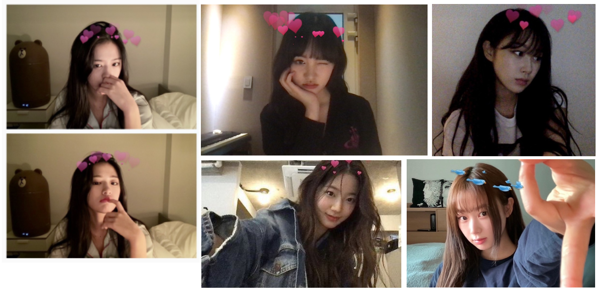
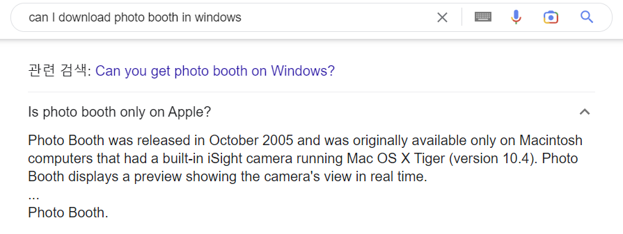
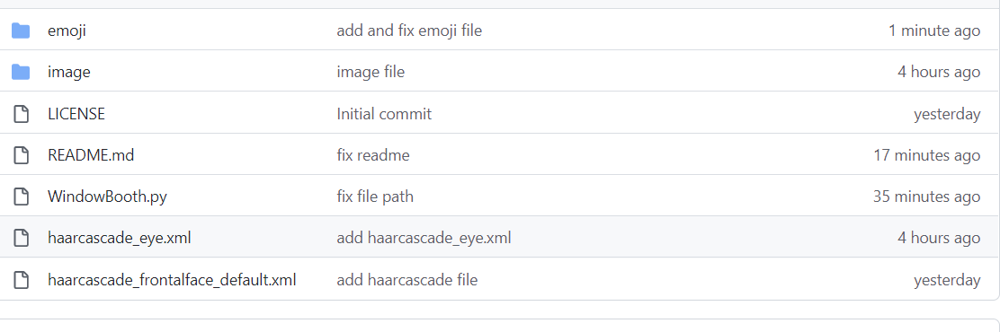

# Hi there👋

Do you know **macbook selfie** getting viral in 20s?

but, you can take this sticker selfie in [photobooth](https://support.apple.com/ko-kr/guide/photo-booth/welcome/mac) only...which mean you **must** need to Mac OS!

### Then, Should I buy a MacBook or iMac just for taking a selfie?!

 No way, how about trying our program based on **OpenCV?**

You need a *python 3.8* to use this program.

Download all files in GitHub.

*(This program tested in miniconda3 base)*

Running Code...

Done!
Enjoy our own photobooth 🖥
